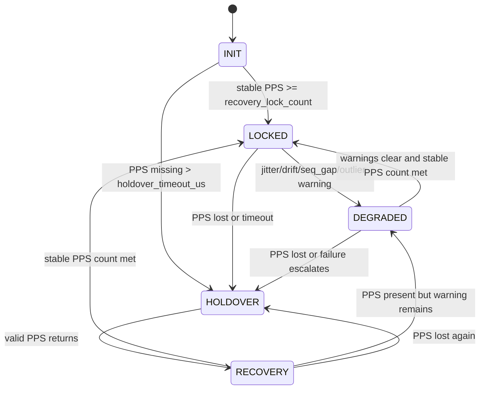

# DCA State Machine

## 1. Purpose

This document defines the engineering behavior contract for the DCA Engine state machine.

The purpose of the state machine is to answer one engineering question clearly:

> When is the corrected time output trustworthy, when is it degraded, and when must the system fall back to holdover behavior?

This document is an acceptance boundary. It is not only an implementation note.

---

## 2. State Definitions

| State | One-line Definition | Engineering Meaning |
|---|---|---|
| `INIT` | Engine has started but has not yet collected enough valid PPS observations. | Output may be generated, but it is not yet trusted as locked time. |
| `LOCKED` | PPS is valid, stable, and the engine has sufficient confidence in offset / drift estimation. | Corrected time is considered trustworthy under normal operating conditions. |
| `DEGRADED` | PPS is present, but abnormal behavior is detected, such as jitter spike, drift anomaly, or sequence gap. | Time output may continue, but confidence must decrease and WARN must be emitted. |
| `HOLDOVER` | PPS is missing or unusable, and the engine predicts time using the last trusted offset / drift snapshot. | Corrected time is still monotonic, but confidence must continuously decay. |
| `RECOVERY` | PPS has returned after HOLDOVER or DEGRADED operation, but lock has not yet been re-established. | Engine is re-validating PPS stability before returning to LOCKED. |

---

## 3. Required Outputs

Every DCA Engine update must output at least:

| Field | Meaning |
|---|---|
| `corrected_time_us` | Corrected timestamp in microseconds. Must be monotonic. |
| `state` | One of `INIT`, `LOCKED`, `DEGRADED`, `HOLDOVER`, `RECOVERY`. |
| `offset_us` | Estimated offset between board time and reference time. |
| `drift_ppm` | Estimated board clock drift in parts per million. |
| `jitter_us` | Estimated short-term timing noise. |
| `confidence` | Trust score in range `[0.0, 1.0]`. |
| `warnings` | List of warnings, such as `WARN_JITTER` or `WARN_SEQ_GAP`. |
| `failure_mode` | Failure mode if applicable, such as `FAIL_DRIFT` or `FAIL_HOLDOVER`. |

---

## 4. State Entry Conditions

### 4.1 `INIT`

Entered when:

- Engine instance is created.
- No valid PPS lock evidence has been accumulated yet.
- Valid PPS count is below the lock threshold.

Typical entry condition:

```text
valid_pps_counter < recovery_lock_count
```

---

### 4.2 `LOCKED`

Entered when all conditions are true:

```text
PPS is present
PPS is valid
jitter <= jitter_threshold
abs(drift_ppm) <= drift_ppm_limit
stable_pps_counter >= recovery_lock_count
no active seq gap warning
```

Engineering meaning:

- PPS is healthy.
- Offset and drift observers are stable enough.
- Corrected time is trusted.
- Confidence should rise toward the locked upper bound.

---

### 4.3 `DEGRADED`

Entered when PPS is still present but one or more abnormal conditions are detected:

```text
jitter > jitter_threshold
or abs(drift_ppm) > drift_ppm_warn_threshold
or seq_gap_detected == true
or outlier_counter > outlier_warn_count
```

Engineering meaning:

- The system is not fully failed.
- Time can still be produced.
- Confidence must drop.
- A WARN condition must be visible in output metrics.

---

### 4.4 `HOLDOVER`

Entered when PPS is missing or unusable:

```text
pps_lost == true
or time_since_last_valid_pps > holdover_timeout_us
or PPS_LOST event is received and accepted by the interface layer
```

Engineering meaning:

- The system no longer has live PPS authority.
- The engine must freeze a holdover snapshot:
  - `holdover_offset_us`
  - `holdover_start_time_us`
  - `holdover_drift_ppm`
- Corrected time must continue monotonically using prediction.
- Confidence must continuously decay.

---

### 4.5 `RECOVERY`

Entered when PPS returns after HOLDOVER or DEGRADED:

```text
state == HOLDOVER and valid PPS is observed
or state == DEGRADED and stable PPS evidence begins to recover
```

Engineering meaning:

- PPS has returned, but the system is not immediately trusted.
- Engine must require multiple stable PPS observations before returning to LOCKED.
- RECOVERY prevents state flapping.

---

## 5. State Exit Conditions

| From State | Exit To | Exit Condition |
|---|---|---|
| `INIT` | `LOCKED` | Enough valid and stable PPS samples are collected. |
| `INIT` | `HOLDOVER` | PPS is missing beyond `holdover_timeout_us`. |
| `LOCKED` | `DEGRADED` | Jitter, drift, seq gap, or outlier warning is detected. |
| `LOCKED` | `HOLDOVER` | PPS is lost or timeout is exceeded. |
| `DEGRADED` | `LOCKED` | Stable PPS is observed for `recovery_lock_count` consecutive samples and warnings clear. |
| `DEGRADED` | `HOLDOVER` | PPS is lost or abnormal behavior escalates to failure. |
| `HOLDOVER` | `RECOVERY` | PPS returns and valid PPS samples begin. |
| `RECOVERY` | `LOCKED` | Stable PPS count reaches `recovery_lock_count`. |
| `RECOVERY` | `DEGRADED` | PPS is present but jitter / drift / seq gap warning remains. |
| `RECOVERY` | `HOLDOVER` | PPS is lost again before lock is re-established. |

---

## 6. State Transition Diagram



---

## 7. Anti-Flapping Rules

To avoid unstable state transitions:

1. `RECOVERY` must require consecutive stable PPS samples before entering `LOCKED`.
2. `DEGRADED` should not immediately return to `LOCKED` after a single good sample.
3. `HOLDOVER` should only exit after PPS returns and passes validity checks.
4. State transitions must be deterministic for replay.

Recommended minimum rules:

```text
recovery_lock_count >= 3
degraded_clear_count >= 3
holdover_exit requires valid PPS
```

---

## 8. Monotonic Time Contract

Regardless of state:

```text
corrected_time_us[n] > corrected_time_us[n - 1]
```

If predicted or corrected time would move backward, the monotonic guard must clamp it forward.

This rule is part of the behavior contract and must not be removed.

---

## 9. Replay Determinism Contract

For identical input event sequences:

```text
same input CSV / event stream
same parameters
same initial state
```

the DCA Engine must produce:

```text
same corrected_time_us
same state sequence
same offset_us sequence
same drift_ppm sequence
same confidence sequence
same warning / failure sequence
```

No wall-clock time, random number, non-deterministic ordering, or external mutable state may affect output.

---

## 10. Acceptance Checklist

| Requirement | Expected |
|---|---|
| State output exists | Every row has one of the required states. |
| PPS normal enters LOCKED | Yes |
| PPS lost enters HOLDOVER | Yes |
| PPS recovery enters RECOVERY before LOCKED | Yes |
| Jitter spike triggers WARN or DEGRADED | Yes |
| Drift anomaly triggers WARN or DEGRADED | Yes |
| Seq gap triggers WARN or DEGRADED | Yes |
| Confidence decays in HOLDOVER | Yes |
| Replay is deterministic | Yes |
