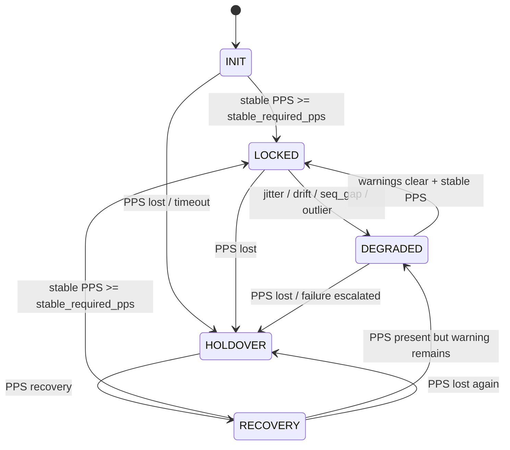

# Round 4 State Machine Scope

本轮 Round 4 验收以当前代码中的 3-state model 为准：

- NORMAL
- HOLDOVER
- RECOVERY

INIT / LOCKED / DEGRADED 如在文档中出现，仅表示后续 Authority Mode / trust model 扩展设计，不作为当前 Round 4 行为验收依据。

当前状态机验证仅属于 mock scenario acceptance，不代表真实硬件 Authority Mode PASS。

# DCA Engine 状态机说明

> 本文档用于定义 DCA Engine 的状态机行为边界。  
> 重点不是描述某一版代码的临时实现，而是明确：  
>
> - 系统什么时候认为时间可信
> - 系统什么时候必须降级
> - 系统什么时候进入 HOLDOVER
> - PPS 恢复后如何重新锁定
> - 哪些异常必须触发 WARN / DEGRADED
>
> 本文档应作为后续代码实现、replay 验证、report 输出和 Trust Check 的共同依据。

---

## 1. 状态机目标

DCA Engine 状态机要回答一个核心工程问题：

> 当前 `corrected_time_us` 是否可信？

因此状态机必须能明确区分：

1. 尚未建立可信锁定
2. PPS 正常且时间可信
3. PPS 存在但质量下降
4. PPS 丢失，需要 holdover
5. PPS 恢复后正在重新验证

---

## 2. 必须输出的状态

DCA Engine 必须输出以下 5 个状态：

| 状态 | 一句话定义 | 工程意义 |
|------|------------|----------|
| `INIT` | 引擎刚启动，还没有足够 PPS 证据建立锁定 | 可以输出时间，但不能认为已经可信锁定 |
| `LOCKED` | PPS 正常、稳定，offset / drift / confidence 均处于可信范围 | `corrected_time_us` 可作为可信时间输出 |
| `DEGRADED` | PPS 仍存在，但检测到 jitter、drift、seq gap 等异常 | 时间输出继续，但必须降级并降低 confidence |
| `HOLDOVER` | PPS 丢失或不可用，系统使用最后可信 offset / drift 进行预测 | 时间保持连续单调，但可信度持续下降 |
| `RECOVERY` | PPS 从丢失或异常状态恢复，正在重新验证稳定性 | 不能立刻回到 LOCKED，必须经过连续稳定 PPS 验证 |

---

## 3. 每次更新必须输出的字段

每次 DCA Engine 更新后，至少应输出以下字段：

| 字段 | 含义 |
|------|------|
| `corrected_time_us` | 修正后的时间戳，单位 us，必须单调递增 |
| `state` | 当前状态：`INIT / LOCKED / DEGRADED / HOLDOVER / RECOVERY` |
| `offset_us` | 当前估计的时间偏移 |
| `drift_ppm` | 当前估计的时钟漂移，单位 ppm |
| `jitter_us` | 当前估计的抖动水平 |
| `confidence` | 当前可信度，范围 0 ~ 1 |
| `warnings` | 当前告警，例如 `WARN_JITTER`、`WARN_SEQ_GAP` |
| `failure_mode` | 当前失败模式，例如 `FAIL_DRIFT`、`FAIL_HOLDOVER` |

---

## 4. 状态定义与进入 / 退出条件

---

## 4.1 INIT

### 状态定义

`INIT` 表示 DCA Engine 已启动，但还没有收集到足够的有效 PPS 样本，不能确认系统已经锁定。

### 工程意义

- 系统刚启动
- offset / drift 还没有稳定估计
- confidence 不能过高
- 不允许直接宣称时间可信

### 进入条件

满足以下任一条件进入 `INIT`：

```text
DCAEngine 初始化完成
```

或：

```text
有效 PPS 样本数 < relock_required_pps
```

### 退出条件

#### INIT -> LOCKED

当连续有效且稳定 PPS 数量达到锁定条件：

```text
valid_pps_counter >= relock_required_pps
stable_pps_counter >= stable_required_pps
jitter_us <= jitter_threshold_us
abs(drift_ppm) <= drift_ppm_limit
```

#### INIT -> HOLDOVER

如果启动后 PPS 长时间不可用：

```text
time_since_last_valid_pps > pps_loss_threshold_s
```

或接口明确收到：

```text
PPS_LOST
```

---

## 4.2 LOCKED

### 状态定义

`LOCKED` 表示 PPS 正常、稳定，DCA Engine 已经建立可信锁定。

### 工程意义

- 系统当前时间可信
- offset 正常收敛
- drift 估计稳定
- jitter 在阈值内
- confidence 应逐步上升并接近上限

### 进入条件

满足以下全部条件可进入 `LOCKED`：

```text
PPS 有效
PPS 未丢失
stable_pps_counter >= stable_required_pps
jitter_us <= jitter_threshold_us
abs(drift_ppm) <= drift_ppm_limit
没有 active seq gap
没有 active failure mode
```

### 退出条件

#### LOCKED -> DEGRADED

出现以下任一异常：

```text
jitter_us > jitter_threshold_us
```

或：

```text
abs(drift_ppm) > drift_ppm_warn_threshold
```

或：

```text
seq_gap_detected == true
```

或：

```text
outlier_counter > outlier_warn_count
```

#### LOCKED -> HOLDOVER

PPS 丢失：

```text
time_since_last_valid_pps > pps_loss_threshold_s
```

或接口明确收到：

```text
PPS_LOST
```

---

## 4.3 DEGRADED

### 状态定义

`DEGRADED` 表示 PPS 仍存在，但时间质量已经下降，系统不能继续维持完全可信状态。

### 工程意义

- 系统没有完全失效
- 但当前 corrected time 不能按 LOCKED 级别信任
- 必须输出 WARN
- confidence 必须下降
- 如果异常持续，应阻止回到 LOCKED

### 进入条件

满足以下任一条件进入 `DEGRADED`：

```text
jitter_us > jitter_threshold_us
```

或：

```text
abs(drift_ppm) > drift_ppm_warn_threshold
```

或：

```text
seq_gap_detected == true
```

或：

```text
outlier_counter > outlier_warn_count
```

### 必须输出的告警

| 异常 | 告警 |
|------|------|
| jitter spike | `WARN_JITTER` |
| seq gap | `WARN_SEQ_GAP` |
| drift 异常但未超过失败阈值 | `WARN_DRIFT` |
| outlier 过多 | `WARN_OUTLIER` |

### 退出条件

#### DEGRADED -> LOCKED

异常清除，且连续稳定 PPS 达到要求：

```text
warnings 为空
stable_pps_counter >= stable_required_pps
jitter_us <= jitter_threshold_us
abs(drift_ppm) <= drift_ppm_warn_threshold
```

#### DEGRADED -> HOLDOVER

PPS 丢失或异常升级为失败：

```text
PPS_LOST
```

或：

```text
time_since_last_valid_pps > pps_loss_threshold_s
```

或：

```text
abs(drift_ppm) > drift_ppm_limit
```

---

## 4.4 HOLDOVER

### 状态定义

`HOLDOVER` 表示 PPS 已丢失或不可用，DCA Engine 使用最后一次可信的 offset / drift 进行时间预测。

### 工程意义

- 系统失去 PPS 权威输入
- 不能继续假装处于稳定状态
- corrected time 必须继续单调递增
- confidence 必须持续下降
- holdover 时间越长，可信度越低

### 进入条件

满足以下任一条件进入 `HOLDOVER`：

```text
PPS_LOST
```

或：

```text
time_since_last_valid_pps > pps_loss_threshold_s
```

或：

```text
PPS 输入不可用
```

或：

```text
异常升级到无法继续 LOCKED / DEGRADED
```

### 进入 HOLDOVER 时必须保存的快照

进入 `HOLDOVER` 时必须保存：

| 字段 | 含义 |
|------|------|
| `holdover_start_time_us` | 进入 holdover 的 board time |
| `holdover_offset_us` | 最后可信 offset |
| `holdover_drift_ppm` | 最后可信 drift |
| `holdover_start_confidence` | 进入 holdover 时的 confidence |

### HOLDOVER 时间计算规则

HOLDOVER 期间：

```text
predicted_offset = holdover_offset_us + holdover_drift_ppm * dt / 1e6
corrected_time_us = board_time_us + predicted_offset
```

其中：

```text
dt = board_time_us - holdover_start_time_us
```

### confidence 规则

HOLDOVER 期间 confidence 必须下降：

```text
confidence = confidence * conf_holdover_decay
```

例如：

```text
conf_holdover_decay = 0.95
```

表示每次更新或每秒下降约 5%。

### 退出条件

#### HOLDOVER -> RECOVERY

当 PPS 恢复并重新出现有效 PPS：

```text
PPS_RECOVERY
```

或：

```text
valid_pps_counter >= 1
```

注意：

```text
HOLDOVER 不能直接跳到 LOCKED
```

必须先进入 `RECOVERY`。

---

## 4.5 RECOVERY

### 状态定义

`RECOVERY` 表示 PPS 已经恢复，但系统还在重新验证 PPS 稳定性，尚不能立即认为时间重新可信。

### 工程意义

- 防止 PPS 瞬时恢复导致状态抖动
- 重新收敛 offset
- 重新估计 drift
- confidence 逐步回升，但不能立刻满信任

### 进入条件

满足以下条件进入 `RECOVERY`：

```text
当前状态 == HOLDOVER
PPS_RECOVERY 或 valid PPS 出现
```

或：

```text
当前状态 == DEGRADED
异常开始恢复，但尚未满足 LOCKED 条件
```

### 退出条件

#### RECOVERY -> LOCKED

连续稳定 PPS 达到要求：

```text
stable_pps_counter >= stable_required_pps
jitter_us <= jitter_threshold_us
abs(drift_ppm) <= drift_ppm_warn_threshold
没有 seq gap
没有 active warning
```

#### RECOVERY -> DEGRADED

PPS 存在，但仍有异常：

```text
jitter_us > jitter_threshold_us
```

或：

```text
seq_gap_detected == true
```

或：

```text
abs(drift_ppm) > drift_ppm_warn_threshold
```

#### RECOVERY -> HOLDOVER

恢复过程中 PPS 再次丢失：

```text
PPS_LOST
```

或：

```text
time_since_last_valid_pps > pps_loss_threshold_s
```

---

## 5. 状态转移总表

| 当前状态 | 目标状态 | 条件 |
|----------|----------|------|
| `INIT` | `LOCKED` | 连续有效稳定 PPS 达到锁定条件 |
| `INIT` | `HOLDOVER` | 启动后 PPS 长时间不可用 |
| `LOCKED` | `DEGRADED` | jitter / drift / seq gap / outlier 异常 |
| `LOCKED` | `HOLDOVER` | PPS 丢失 |
| `DEGRADED` | `LOCKED` | 异常清除且连续稳定 PPS 达标 |
| `DEGRADED` | `HOLDOVER` | PPS 丢失或异常升级为失败 |
| `HOLDOVER` | `RECOVERY` | PPS 恢复 |
| `RECOVERY` | `LOCKED` | 连续稳定 PPS 达标 |
| `RECOVERY` | `DEGRADED` | PPS 存在但仍有异常 |
| `RECOVERY` | `HOLDOVER` | PPS 再次丢失 |

---

## 6. 状态转移图

### 6.1 文字版

```text
INIT
  ├── PPS 稳定且满足锁定条件 ──> LOCKED
  └── PPS 丢失 / 长时间不可用 ──> HOLDOVER

LOCKED
  ├── jitter / drift / seq_gap / outlier 异常 ──> DEGRADED
  └── PPS 丢失 ──> HOLDOVER

DEGRADED
  ├── 异常清除 + 连续稳定 PPS ──> LOCKED
  └── PPS 丢失 / 异常升级 ──> HOLDOVER

HOLDOVER
  └── PPS 恢复 ──> RECOVERY

RECOVERY
  ├── 连续稳定 PPS 达标 ──> LOCKED
  ├── PPS 存在但仍异常 ──> DEGRADED
  └── PPS 再次丢失 ──> HOLDOVER
```

### 6.2 Mermaid 版



---

## 7. 异常行为处理要求

以下异常必须被识别，并至少触发 `WARN` 或 `DEGRADED`：

| 异常 | 触发条件 | 必须响应 |
|------|----------|----------|
| jitter spike | `jitter_us > jitter_threshold_us` | `WARN_JITTER`，confidence 下降，进入或保持 DEGRADED |
| drift | `abs(drift_ppm) > drift_ppm_warn_threshold` | `WARN_DRIFT`，confidence 下降 |
| drift failure | `abs(drift_ppm) > drift_ppm_limit` | `FAIL_DRIFT`，禁止进入 LOCKED |
| seq gap | `seq_gap_detected == true` | `WARN_SEQ_GAP`，confidence 下降，进入或保持 DEGRADED |
| PPS lost | `PPS_LOST` 或 timeout | 进入 HOLDOVER |
| PPS recovery | `PPS_RECOVERY` 或 valid PPS 恢复 | 进入 RECOVERY，不能直接 LOCKED |

---

## 8. confidence 行为要求

| 状态 | confidence 行为 |
|------|-----------------|
| `INIT` | 初始中低值，不能过高 |
| `LOCKED` | 随连续有效 PPS 上升，最高不超过上限 |
| `DEGRADED` | 必须下降或被限制在低于 LOCKED 的上限 |
| `HOLDOVER` | 必须持续下降，不能假稳定 |
| `RECOVERY` | 随稳定 PPS 逐步回升，但不能直接跳到最高值 |

推荐约束：

```text
LOCKED confidence <= 0.99
RECOVERY confidence <= 0.90
DEGRADED confidence <= 0.80
HOLDOVER confidence 按 conf_holdover_decay 持续下降
```

---

## 9. monotonic guarantee

无论处于任何状态，`corrected_time_us` 必须满足：

```text
corrected_time_us[n] > corrected_time_us[n-1]
```

如果计算结果可能回退，必须通过 monotonic guard 修正：

```text
corrected_time_us = max(corrected_time_us, last_output_time + 1)
```

该规则属于行为契约，不能删除。

---

## 10. replay determinism

DCA Engine 必须满足 replay 一致性：

```text
相同输入
相同参数
相同初始状态
```

必须得到：

```text
相同 corrected_time_us
相同 state 序列
相同 offset_us 序列
相同 drift_ppm 序列
相同 confidence 序列
相同 warnings / failure_mode
```

禁止引入：

- 随机数
- 当前系统时间
- 线程调度结果
- 非确定性遍历顺序
- 外部可变状态

---

## 11. 当前代码对齐说明

如果当前实现仍使用：

```text
NORMAL / HOLDOVER / RECOVERY
```

则需要在后续实现中对齐为本文档定义的 5 状态模型：

```text
INIT / LOCKED / DEGRADED / HOLDOVER / RECOVERY
```

推荐映射关系：

| 当前状态 | 新状态建议 |
|----------|------------|
| 初始化阶段 | `INIT` |
| `NORMAL` 且 PPS 稳定 | `LOCKED` |
| `NORMAL` 但 jitter / drift / seq gap 异常 | `DEGRADED` |
| `HOLDOVER` | `HOLDOVER` |
| `RECOVERY` | `RECOVERY` |

注意：

```text
NORMAL 不应继续作为最终验收状态名称
```

因为霍工验收边界明确要求输出：

```text
INIT / LOCKED / DEGRADED / HOLDOVER / RECOVERY
```

---

## 12. 验收 Checklist

| 验收项 | 要求 | 当前结论 |
|--------|------|----------|
| 状态机有明确状态输出 | 必须输出 5 状态之一 | `___` |
| PPS 正常进入 LOCKED | 必须进入 | `___` |
| PPS 正常输出 offset | 必须输出 | `___` |
| PPS 正常输出 drift | 必须输出 | `___` |
| PPS 正常输出 jitter | 必须输出 | `___` |
| PPS 正常输出 confidence | 必须输出 | `___` |
| PPS 丢失进入 HOLDOVER | 必须进入 | `___` |
| HOLDOVER confidence 下降 | 必须下降 | `___` |
| PPS 恢复进入 RECOVERY | 必须进入 | `___` |
| RECOVERY 后再进入 LOCKED | 必须经过稳定 PPS 验证 | `___` |
| jitter spike 触发 WARN / DEGRADED | 必须触发 | `___` |
| drift 触发 WARN / DEGRADED | 必须触发 | `___` |
| seq gap 触发 WARN / DEGRADED | 必须触发 | `___` |
| replay 一致性 | 同输入同输出 | `___` |

---

## 13. 后续需要补充的验证场景

建议增加以下 replay / fake scenario / 实机日志：

1. `normal`
   - 验证 INIT -> LOCKED
   - 验证 confidence 上升
   - 验证 offset / drift 稳定

2. `drift_slow`
   - 验证 drift warning
   - 验证 DEGRADED
   - 验证 confidence 下降

3. `jitter_spike`
   - 验证 `WARN_JITTER`
   - 验证 outlier 不污染 offset / drift

4. `pps_lost_holdover`
   - 验证 PPS_LOST -> HOLDOVER
   - 验证 holdover 期间 corrected_time_us 单调
   - 验证 confidence 持续下降

5. `pps_recovery`
   - 验证 HOLDOVER -> RECOVERY
   - 验证 RECOVERY -> LOCKED
   - 验证不允许 HOLDOVER 直接跳 LOCKED

6. `seq_gap`
   - 验证 `WARN_SEQ_GAP`
   - 验证 confidence 下降
   - 验证 DEGRADED 或 metrics 记录

---

## 14. 本阶段结论

本阶段 DCA Engine 状态机的核心验收目标不是“算法调得最好看”，而是建立一个：

```text
可解释
可降级
可复现
可签字
```

的时间可信边界。

最终要证明：

> DCA Engine 在什么情况下可以被信任，在什么情况下必须降级或不能信。
